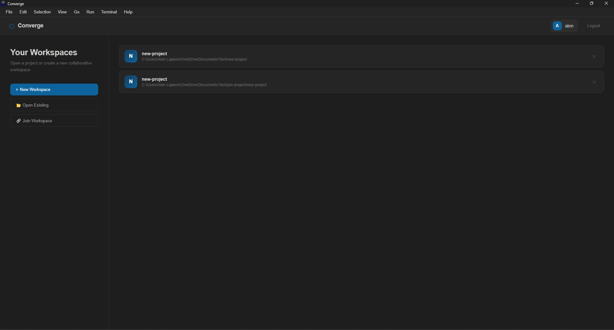
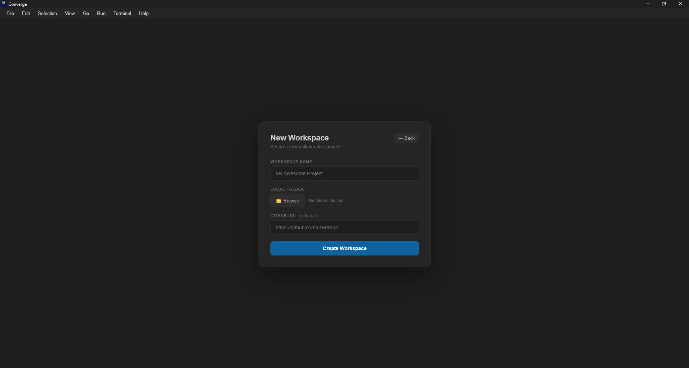
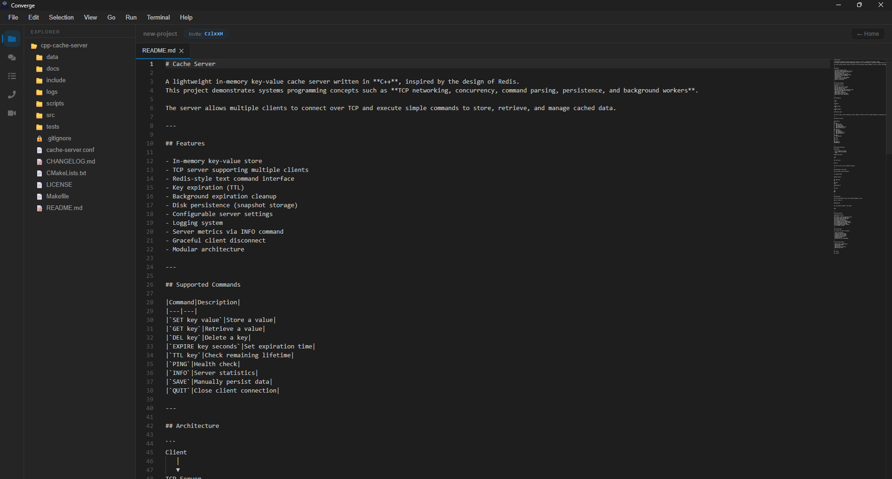
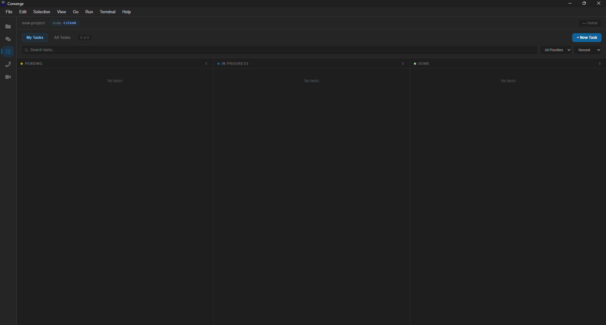
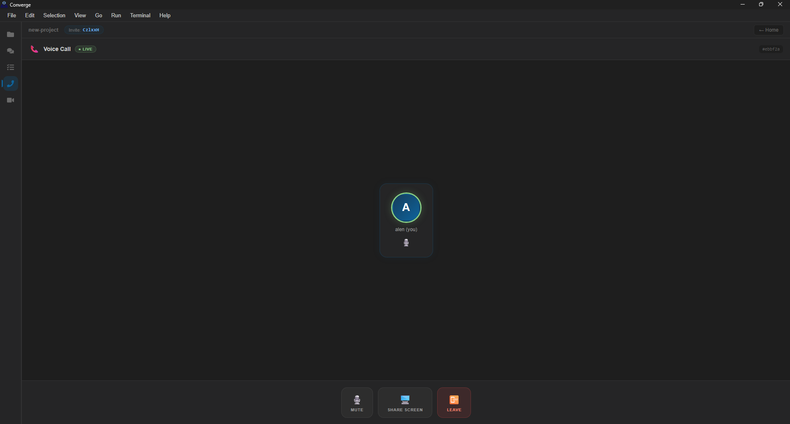
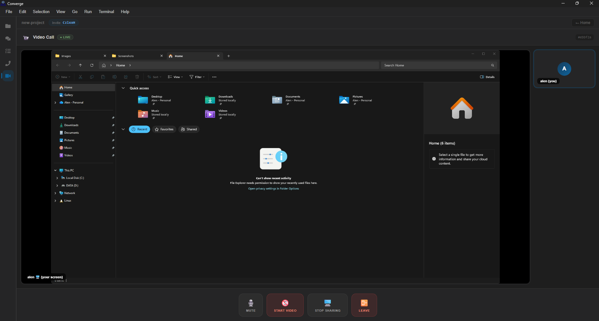
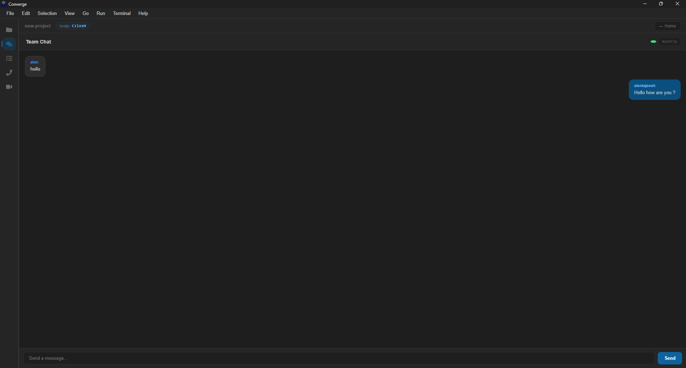

# Converge 🚀

Converge is a desktop workspace that brings code editing, team chat, calls, and task management into one app — built for dev teams working on shared GitHub projects. Instead of switching between VS Code, Slack, and a task tracker, everything lives in a single lightweight window per workspace.

## 📖 About

Most dev teams end up stitching together a separate editor, chat app, video call tool, and task tracker just to get through a normal workday. Converge exists to close that gap by giving a team one shared space per project: open the workspace, and you get the code, the conversation, and the task board together, backed by the same real-time connection.

It's built as a native desktop app rather than a website — using Tauri instead of Electron — so it stays lightweight while still getting real access to the local file system and terminal, things a browser-based tool can't do on its own. Under the hood it's a fairly standard MERN-style stack (MongoDB, Express, React, Node) for the backend and UI, with Socket.io handling anything that needs to happen live — chat, task updates, and call signaling — and WebRTC handling the actual audio/video peer-to-peer.

This is a personal/learning project rather than a polished product, so expect some rough edges as features get built out.

## 📸 Screenshots

**Workspaces Dashboard** — open an existing workspace, create a new one, or join a teammate's via invite code.


**New Workspace** — set up a workspace by picking a local folder and (optionally) linking a GitHub repo.


**Code Editor** — Monaco-powered editing with a familiar VS Code–like layout and file explorer.


**Task Board** — Kanban-style tracking across Pending, In Progress, and Done.


**Voice Call** — quick peer-to-peer voice calls with mute/leave controls, no separate app needed.


**Video Call & Screen Share** — video calls with live screen sharing for walking teammates through code.


**Team Chat** — real-time workspace chat for quick back-and-forth without leaving the app.


## ✨ Features

- 🧑‍💻 **Shared Workspaces**
  A workspace is linked to a GitHub repository and acts as the shared space for a team — everyone in it sees the same chat, tasks, and members. Workspaces map to a local project folder on each member's machine.

- 🔗 **Invite-Based Collaboration**
  Every workspace gets a unique, stable join code (generated with `nanoid`) so teammates can hop in instantly without a formal invite flow. The code never changes, which keeps things in sync as the team grows.

- 📝 **Built-In Code Editor**
  Powered by Monaco (the same editor that runs VS Code), so editing files inside a workspace feels familiar — syntax highlighting, multi-file editing, and more.

- 💬 **Real-Time Chat**
  Each workspace has its own chat room, powered by Socket.io over WebSockets. Messages are scoped to the workspace and can be deleted.

- 📞 **Audio & Video Calls**
  Peer-to-peer calls via WebRTC, with the backend only handling signaling (offer/answer/ICE exchange) — actual audio/video never touches the server, keeping calls fast and load on the backend minimal.

- 📋 **Task Board**
  A Kanban-style board for managing work: create tasks, assign them to teammates, set priority (low/medium/high), and track status (pending → in progress → done).

- 🖥️ **Integrated Terminal**
  Run shell commands directly inside the app without leaving the workspace, useful for quick git commands, builds, or scripts.

- 📂 **Local File System Access**
  Since Converge is a native desktop app (not a browser sandbox), it can read, write, create, delete, and rename files directly on disk for the linked project folder.

## 🏗️ Tech Stack

**Desktop Shell**
- [Tauri v2](https://tauri.app/) — lightweight Rust-based desktop framework (apps are ~8–15MB vs Electron's ~150–200MB, since it uses the OS's native webview instead of bundling Chromium)
- Rust — handles system-level operations (file system, terminal, IPC)

**Frontend**
- React (Create React App) + React Router v6
- Monaco Editor
- Socket.io-client (chat/real-time events)
- simple-peer (WebRTC calls)

**Backend**
- Node.js + Express (REST API)
- Socket.io (chat & call signaling)
- MongoDB + Mongoose (data storage)
- JWT authentication + bcrypt password hashing

## 📁 Project Structure

```
converge-app/
├── backend/
│   └── src/
│       ├── config/        # DB connection
│       ├── controllers/   # auth, chat, task, workspace logic
│       ├── middleware/    # auth middleware
│       ├── models/        # User, Workspace, Message, Task
│       ├── routes/        # REST API routes
│       └── sockets/       # real-time chat/call events
├── frontend/
│   └── src/
│       ├── components/    # Editor, ChatView, CallView, TaskView, Terminal, etc.
│       ├── context/       # Auth & Theme context
│       ├── hooks/         # custom hooks
│       └── pages/         # Auth, Dashboard, CreateWorkspace, WorkspaceHome
├── src-tauri/              # Rust desktop shell & IPC commands
└── assets/
```

## 🔌 How It Fits Together

- **Auth** — users register/log in, get a JWT, and the frontend stores it via `AuthContext`.
- **Workspaces** — creating a workspace links a GitHub repo URL + a local folder; joining one uses the workspace's invite code.
- **Realtime layer** — once inside a workspace, the client joins a Socket.io room scoped to that workspace ID, which powers chat, task updates, and call signaling.
- **Desktop layer** — Tauri exposes IPC commands (`read_dir`, `read_file`, `write_file`, `run_command`, etc.) so the React frontend can interact with the local file system and terminal directly, something a normal web app can't do.

## ⬇️ Download

Grab the latest build for your OS from the [Releases](../../releases) page.

- 🐧 Linux: `.deb`, `.rpm`, `.AppImage`
- 🪟 Windows: `.exe`, `.msi`

## 🛠️ Local Development

```bash
git clone https://github.com/alenlajeesh/converge-app
cd converge-app
npm install
cd frontend && npm install && cd ..
cd backend && npm install && cd ..

npm run backend
npm run frontend
npx wait-on http://localhost:3000 && npm run tauri:dev
```

Note - Do not forget to add the .env file.

## 📄 License

MIT
